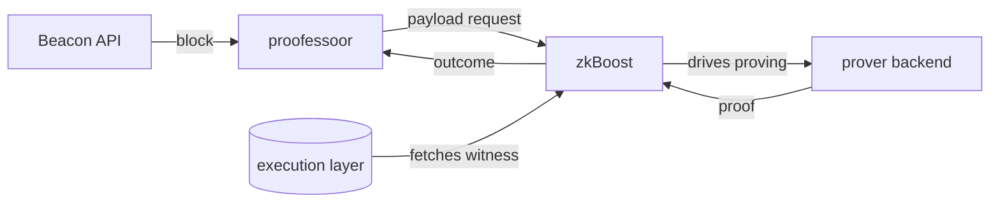

<p align="center">
  
</p>

# proofessoor

A small, clientless requestor that asks [zkBoost](https://github.com/eth-act/zkboost)
to prove Ethereum execution blocks — and tracks how each request goes.

> **Clientless** means it runs no execution or consensus client of its own. It
> only speaks HTTP to a Beacon API (to read blocks) and to zkBoost (to request
> proofs). That keeps it small and easy to run next to existing infrastructure.

## What it does

proofessoor watches Ethereum blocks and drives a proof request for each one, then
records how every request turns out. For each new block it reads the block from a
Beacon API, builds the payload request zkBoost expects, submits it, and tracks the
outcome. zkBoost coordinates the proving — it fetches the execution witness and
runs whatever prover backend it's configured with.



proofessoor is deliberately narrow in scope: it requests proofs and tracks their
status. It does not sign, run a validator, or execute blocks itself — which is
what keeps it small. It also doesn't care *how* zkBoost proves a block: the prover
backend might be a single ZisK server, a cluster, or anything else zkBoost
supports. proofessoor only speaks to zkBoost's API.

## Build

```bash
cargo build --release        # binary at target/release/proofessoor
```

The dashboard (optional, served by `stream`) is a separate frontend build:

```bash
cd frontend && bun install && bun run build   # assets land in frontend/dist
```

Prefer containers? See [Run the full stack](#run-the-full-stack).

## Configure

Two endpoints are always required — pass them as flags or environment variables:

- **`--beacon-url`** (`PROOFESSOOR_BEACON_URL`) — your Beacon API's HTTP
  endpoint. It must serve blocks, `/eth/v1/config/spec`, and
  `/eth/v1/beacon/genesis`; proofessoor fetches the latter two once at startup
  to resolve the execution fork required by zkBoost. For an authenticated
  beacon, add `--beacon-header "Name: Value"`
  (`PROOFESSOOR_BEACON_HEADER`), e.g. an API key.
- **`--zkboost-url`** (`PROOFESSOOR_ZKBOOST_URL`) — your zkBoost instance's
  address. Coordinates the proving.

zkBoost itself needs an execution-layer RPC that serves
`debug_executionWitnessByBlockHash` — that's configured in zkBoost, not here.

## Core commands

The examples use `reth-zisk` as a proof type; use whatever your zkBoost is
configured for (`check` lists them).

### `check` — is zkBoost reachable, and can it prove what I want?

```bash
proofessoor check --zkboost-url <zkboost-url> --proof-types reth-zisk
```

Lists the proof types zkBoost can currently produce, and fails if any requested
type is unavailable. Run this first.

### `request` — prove one block, then exit

```bash
proofessoor request \
  --beacon-url <beacon-url> \
  --zkboost-url <zkboost-url> \
  --proof-types reth-zisk \
  --block-id head \
  --wait --verify
```

`--block-id` accepts `head`, `genesis`, `finalized`, `justified`, a slot number,
or a `0x` block root. Add `--wait` to block until the proof finishes, `--verify`
to verify it through zkBoost, and `--download`/`--out-dir` to save the proof
bytes. One-shot `request` can take several proof types at once.

### `stream` — keep proving new blocks

```bash
proofessoor stream \
  --beacon-url <beacon-url> \
  --zkboost-url <zkboost-url> \
  --proof-types reth-zisk \
  --state-dir ./state \
  --http-addr <host:port> \
  --ui-dir frontend/dist \
  --grafana-url <grafana-url>
```

Follows the Beacon API event stream and requests a proof for each new
non-optimistic block. Useful flags:

- `--max-inflight N` — cap concurrent submissions (default 1).
- `--state-dir DIR` — persist status in `proofessoor.sqlite` so restarts don't
  re-request blocks. An existing v0.3 `status.json` is imported once and left
  untouched as a backup; subsequent writes go only to SQLite.
- `--max-history N` — retain at most N request records. The default `0` is
  unlimited; set a nonzero cap only when the operator wants explicit pruning.
  The oldest settled records are removed first. If outstanding work alone
  exceeds the hard cap, its eviction is surfaced in logs and metrics.
- `--http-addr HOST:PORT` — serve the dashboard, metrics, and health (below).
- `--ui-dir DIR` — directory of built dashboard assets to serve.
- `--grafana-url URL` (`PROOFESSOOR_GRAFANA_URL`) — optional Grafana base URL
  used to link recorded trace IDs into Tempo Explore. Without it, the dashboard
  shows a copyable plain trace ID.
- `--download` / `--verify` / `--out-dir` — save and/or verify completed proofs.
- `--reconcile-after DURATION` — how long a submitted proof may stay silent
  before reconciliation marks it failed as `Unresolved` (default `900s`;
  accepts `s`/`m`/`h` suffixes). Budget zkBoost's whole pipeline:
  `witness_timeout` + worst-case queue wait + `proof_timeout` — the queue wait
  is unbounded under proving backlog (`proof_timeout` bounds only the prove
  call), so leave generous headroom. Reconciliation runs when the proof-event
  stream (re)connects and periodically while connected, probing only records
  older than a quarter of this cutoff; silence only counts while zkBoost is
  observably reachable, and all verdicts are deferred while it is not. A real
  outcome arriving after a proof was already judged is discarded (records
  resolve once) but is counted in
  `proofessoor_late_events_discarded_total{kind}` and logged, so a wrong
  verdict is observable. Missed terminal outcomes are recovered from zkBoost's
  replay caches, but those caches hold only the most recent completions and
  failures (LRU, 128 entries per configured zkVM by default), so an outage
  spanning more than that replay horizon can still lose outcomes.

> **Stream proves one proof type at a time.** The status model tracks each
> proof type separately, but multi-proof streaming is unexercised end to end
> (dashboard aggregation, per-type failure display) and proving several types
> per block multiplies prover cost, so stream currently accepts exactly one
> `--proof-types` value. Use `request` for multiple.

`--http-addr` takes a host and port of your choosing and serves three things on
that address: the dashboard at `/`, Prometheus metrics at `/metrics`, and a
health check at `/health`. The request table uses stable 100-record cursor
pages, so newly arriving slots do not shift an operator's older page. Exact
slot/request-root searches, outcome and duration filters, and timing sorts run
in SQLite across all retained records rather than only the visible page.
The table distinguishes proofessoor's submit-to-terminal turnaround from
zkBoost's witness, queue, and proof-generation stage timings. Narrower
viewports progressively hide the three stage columns, while their filters and
sorts remain available. The block detail view
shows every stage, whether the terminal outcome arrived live or through
reconciliation, and the trace ID. Missing stage data remains unknown (`—`),
never zero. Unresolved requests sort after resolved durations. Pausing stops
automatic polling; an explicit search or filter change refreshes the dashboard
once.

The metrics include `proofessoor_store_records`, `proofessoor_store_bytes` (the
database plus its write-ahead log), and
`proofessoor_store_evictions_total{kind="settled|outstanding"}` so growth and
retention remain visible.
`proofessoor_request_stage_duration_seconds{stage="fetch|build|submit|verify"}`
shows proofessoor's request and optional verification work.
`proofessoor_proof_completion_duration_seconds{proof_type,source}` separates
live completions from reconciliation discoveries so detection delay can be
excluded from latency views. Its buckets use 0.5-second steps through the
12-second slot budget, then 15, 30, 60, 120, 300, and 900 seconds.

The Compose stacks persist the complete `/state` directory in a named volume.
Do not mount only `proofessoor.sqlite`: SQLite keeps its WAL and shared-memory
files beside it. A replacement host bind directory must be writable by the
container's nonroot uid `65532`.

### Distributed tracing (optional)

Release and Docker images include the optional `otel` support; for a manual
build, enable it with `cargo build --release --features otel`. Each block gets a
`prove_block` span covering fetch, build, submit, and the terminal wait, closed
with the block's terminal outcome; the trace id is stored on the block's status
record. The exporter reads the standard `OTEL_EXPORTER_OTLP_ENDPOINT` variable
— when unset, tracing stays off and behavior is identical to a build without
the feature. `OTEL_SERVICE_NAME` overrides the default service name
`proofessoor`. Outbound zkBoost calls carry the active W3C trace context; a
zkBoost build with inbound context extraction joins those calls to the same
distributed trace.

### `status` — read what was recorded

```bash
proofessoor status --state-dir ./state
```

Prints each recorded request with its outcome and per-block timing (prep,
zkBoost, end-to-end) — the same data the dashboard shows, from the terminal.
This command is inspection-only: it does not create a database, apply
migrations, or consume the one-time legacy import. Missing or incompatible
state fails loudly. The stream service owns supported schema upgrades; do not
wipe the state directory during ordinary upgrades.

## Run the full stack

To run real proving on a GPU box (proofessoor + zkBoost + a prover), see
[`deploy/gpu/`](deploy/gpu/) — a Docker Compose stack, with its own README, that
wires up an ere-server (ZisK) as the backend.

## Development

```bash
cargo fmt --check
cargo clippy --all-targets --locked -- -D warnings
cargo test --locked
cargo deny check                              # dependency advisories + licenses

cd frontend && bun run check && bun run test && bun run build
```

The toolchain is pinned in `rust-toolchain.toml`; lint policy lives in
`Cargo.toml` (`[lints.clippy]`) and `clippy.toml`; dependency policy in
`deny.toml`.

## License

MIT OR Apache-2.0.
